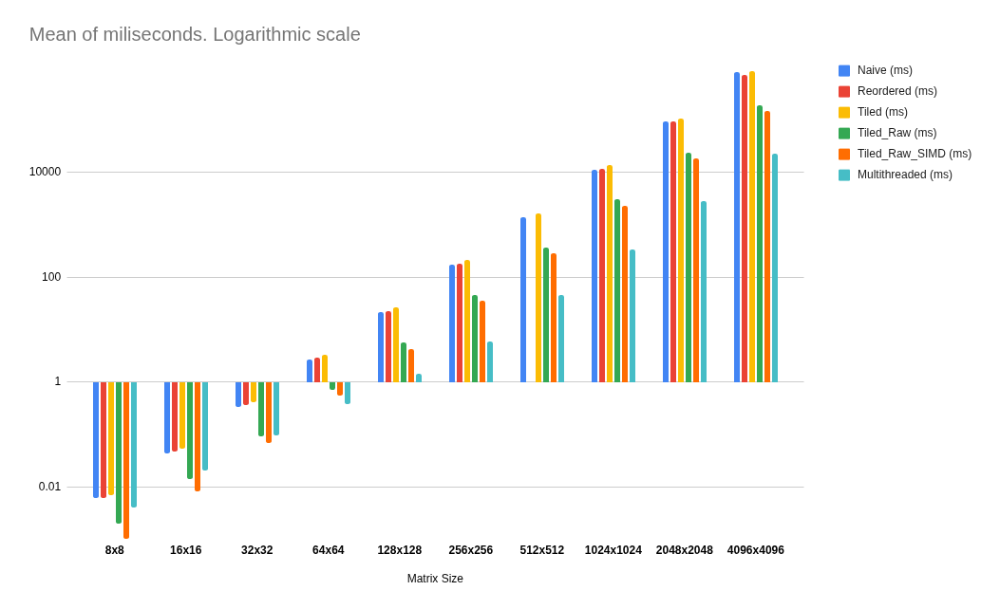

```
███╗   ███╗ █████╗ ████████╗██████╗ ██╗██╗  ██╗ ██████╗ ██████╗ ███████╗
████╗ ████║██╔══██╗╚══██╔══╝██╔══██╗██║╚██╗██╔╝██╔═══██╗██╔══██╗██╔════╝
██╔████╔██║███████║   ██║   ██████╔╝██║ ╚███╔╝ ██║   ██║██████╔╝███████╗
██║╚██╔╝██║██╔══██║   ██║   ██╔══██╗██║ ██╔██╗ ██║   ██║██╔═══╝ ╚════██║
██║ ╚═╝ ██║██║  ██║   ██║   ██║  ██║██║██╔╝ ██╗╚██████╔╝██║     ███████║
╚═╝     ╚═╝╚═╝  ╚═╝   ╚═╝   ╚═╝  ╚═╝╚═╝╚═╝  ╚═╝ ╚═════╝ ╚═╝     ╚══════╝
```
# MatrixOps
## Multiply matrices 36 times faster that with your O(n^3) naive loop!
Ultra-efficient operations with matrices.

High-performance, header-only C++ library for linear algebra, built from scratch.
It combines a "lazy" expression template system for fast arithmetic with an aggressively optimized (SIMD, multithreaded) GEMM kernel for pro-level performance. Benchmarks at the end of this readme.

### Lazy expression templates?
Lazy expression templates work by **delaying computations and fusing operations into a single loop at compile time**, eliminating temporary matrices and redundant iterations: M = A + B + C is done in just one operation, within a single loop, no temporal variables.

### Optimized GEMM operation?
Our optimized GEMM achieves performance through **data locality (tiling), parallel processing (multithreading), and SIMD instructions (vectorization)**, maximizing hardware utilization.

* **Data Locality (Tiling):** We solve the "slow memory" problem by breaking the matrix into tiny blocks that fit in the CPU's fast L1 cache, so it never has to wait for RAM.
* **Parallel Processing (Multithreading):** We solve the "single core" problem by splitting the work among all 8 of your CPU cores, letting them all run at the same time.
* **SIMD Instructions (Vectorization):** We solve the "one calculation at a time" problem by using AVX instructions that multiply 4 numbers at once instead of just one.

## Available operations
### Core & Utility Operations
* **Constructors:**
    * Create a matrix with specific dimensions (e.g., `Matrix(rows, cols)`).
    * Load a matrix from a **binary file**.
    * Load a matrix from a **CSV file**.
* **I/O:**
    * `save_binary()`: Save the matrix to a high-speed binary file.
    * `save_csv()`: Save the matrix to a human-readable CSV file.
    * `print()`: Display the matrix in the console.
* **Data Access & Manipulation:**
    * `fill_random()`: Fill the matrix with random numbers (supports `int`, `float`, `double`).
    * `at()`: Access a single element with bounds-checking.
    * `raw_data()`: Get a direct, high-performance pointer to the matrix's data.
    * `swap_rows()`: A helper function to swap two rows in-place.

---

### Matrix Arithmetic
* **Matrix-Matrix (Lazy Expression Templates):**
    * `operator+` (Addition, `A + B`)
    * `operator-` (Subtraction, `A - B`)
* **Matrix-Matrix (High-Performance Kernel):**
    * `operator*` (Matrix Multiplication, `A * B`): A "smart dispatcher" that automatically calls your fastest, multithreaded, SIMD-optimized kernel.
* **Scalar-Matrix (Lazy Expression Templates):**
    * `operator+` (Scalar Addition, `A + 5.0` and `5.0 + A`)
    * `operator-` (Scalar Subtraction, `A - 5.0` and `5.0 - A`)
    * `operator*` (Scalar Multiplication, `A * 5.0` and `5.0 * A`)
    * `operator/` (Scalar Division, `A / 5.0`)

---

### Unary & Linear Algebra Operations
* **Unary (Lazy Expression Templates):**
    * `transpose()`: Returns a "lazy" transposed view of a matrix.
* **Linear Algebra (Based on LUP Decomposition):**
    * `determinant()`: Calculates the determinant of the matrix.
    * `rank()`: Calculates the rank of the matrix.
    * `solve()`: Solves a system of linear equations (`Ax = b`).
    * `inverse()`: Calculates the inverse of the matrix.


## Benchmarks

Benchmark for matrix multiplication.

Here is the optimization breakdown, using your 4096x4096 matrix benchmark as the reference.

We tested each optimization in an additive way, that means that each level of optimization keeps the previous optimizations. We tested them respect the baseline (three loops, nothing fancy) and respect the previous optimization level.

**Baseline (Naive):** 807,730 ms

* **Optimization 1: Loop Reordering (`Reordered`)**
    * **Time:** 735,108 ms
    * **Improvement vs. Previous:** **1.1x faster** (The compiler was likely already doing this, so the change was minimal).
    * **Improvement vs. Naive:** **1.1x faster**

* **Optimization 2: Tiling (`Tiled`)**
    * **Time:** 866,275 ms
    * **Improvement vs. Previous:** **0.85x** (This step was *slower* because the overhead of new loops and `at()` function calls outweighed the cache benefits).
    * **Improvement vs. Naive:** **0.93x** (Slower than Naive).

* **Optimization 3: Tiling + Raw Pointers (`Tiled_Raw`)**
    * **Time:** 191,578 ms
    * **Improvement vs. Previous:** **4.5x faster** (This was the breakthrough, proving the `at()` function calls were the real bottleneck).
    * **Improvement vs. Naive:** **4.2x faster**

* **Optimization 4: Tiling + Raw + SIMD (`Tiled_Raw_SIMD`)**
    * **Time:** 148,862 ms
    * **Improvement vs. Previous:** **1.29x faster** (Using AVX to do 4 calculations at once gave a solid boost).
    * **Improvement vs. Naive:** **5.4x faster**

* **Optimization 5: Multithreading (`Multithreaded`)**
    * **Time:** 22,318 ms
    * **Improvement vs. Previous:** **6.67x faster** (Using all 8 CPU cores provided the biggest leap).
    * **Improvement vs. Naive:** **36.2x faster** (This is the final, total speedup).


### Measured data

| Matrix Size | Naive (ms) | Reordered (ms) | Tiled (ms) | Tiled\_Raw (ms) | Tiled\_Raw\_SIMD (ms) | Multithreaded (ms) |
| :--- | :--- | :--- | :--- | :--- | :--- | :--- |
| 8x8 | 0.006 | 0.006 | 0.007 | 0.002 | 0.001 | 0.004 |
| 16x16 | 0.043 | 0.046 | 0.052 | 0.014 | 0.008 | 0.020 |
| 32x32 | 0.338 | 0.361 | 0.411 | 0.090 | 0.067 | 0.095 |
| 64x64 | 2.67 | 2.87 | 3.29 | 0.716 | 0.539 | 0.379 |
| 128x128 | 21.2 | 22.8 | 26.1 | 5.74 | 4.28 | 1.43 |
| 256x256 | 171 | 181 | 209 | 45.8 | 35.6 | 5.81 |
| 512x512 | 1368 | 1441 | 1666 | 368 | 287 | 45.2 |
| 1024x1024 | 10940 | 11488 | 13459 | 3012 | 2310 | 340 |
| 2048x2048 | 93438 | 92513 | 107531 | 23704 | 18532 | 2763 |
| 4096x4096 | 807730 | 735108 | 866275 | 191578 | 148862 | 22318 |

